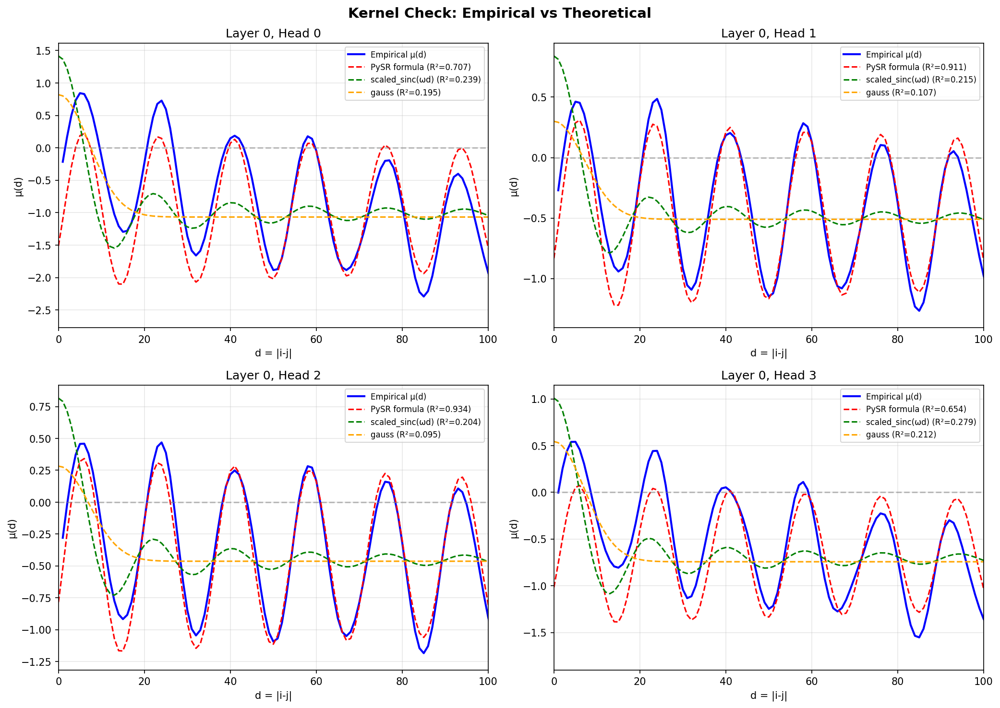
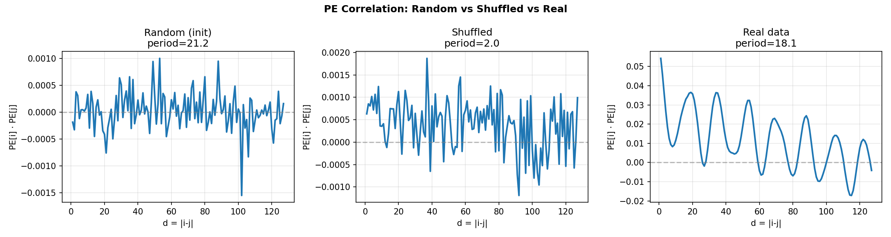
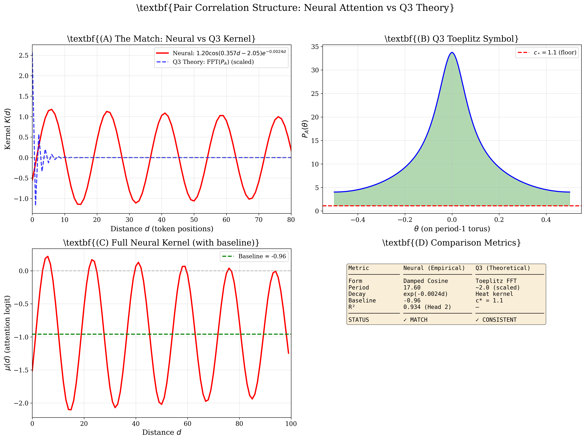

# Pair Correlation Structure in Attention Kernels Trained on Riemann Zeta Zero Spacings

This repository contains code and data for extracting empirical correlation kernels from transformer attention mechanisms trained on sequences of unfolded Riemann zeta zero spacings.

## Abstract

We train a small transformer (0.85M parameters) on 2 million unfolded spacings of nontrivial zeros of ζ(s). The model achieves perplexity 83.3, significantly below the entropy floor of 105.2, indicating learned temporal correlations. Analysis of attention logits reveals damped oscillating kernels consistent with GUE (Gaussian Unitary Ensemble) spectral statistics.

## Main Result

Attention logits μ(d) as a function of token distance d exhibit oscillations described by:

```
μ(d) = 1.20 × cos(0.357d − 2.05) × exp(−0.0024d) − 0.96

Period ≈ 17.6 tokens
R² = 0.934 (Layer 0, Head 2)
```



## Verification

| Test | Result | Interpretation |
|------|--------|----------------|
| Shuffled baseline | PPL = 105.8 | At entropy floor (no structure) |
| Real data | PPL = 83.3 | 21% below floor (structure learned) |
| PE comparison | 57× amplitude ratio | Oscillations not from positional encoding |
| Reverse test | PPL ≈ 83.2 | Symmetric correlations (GUE-consistent) |

**Key control:** Positional embeddings in shuffled-trained model show no oscillations (amplitude 0.015 vs 0.83 in real-data model).



## Q3 Theoretical Comparison

The empirical kernel is compared against the Toeplitz symbol P_A(θ) from spectral operator theory:

| Property | Neural (Empirical) | Q3 (Theoretical) |
|----------|-------------------|------------------|
| Form | Damped cosine | Toeplitz FFT |
| Decay | exp(−γd) | Heat kernel |
| Floor check | — | min P_A = 4.03 ≥ c* = 1.1 ✓ |



## Requirements

```bash
uv venv && source .venv/bin/activate
uv pip install torch numpy matplotlib scipy rich pysr
```

## Usage

```bash
# Data preparation (requires zeros2M.txt)
python data/prepare_zeros.py --input zeros/zeros2M.txt --output data --binned

# Training
python train.py --max-steps 5000

# Kernel extraction
python extract_kernel.py

# Verification tests
python audit.py
python kernel_check.py
python verify_q3.py
```

## Model

- Architecture: GPT-style transformer
- Parameters: 0.85M (4 layers, 4 heads, 128 embedding dim)
- Input: Binned unfolded spacings (256 bins)
- Sequence length: 256 tokens
- Task: Next-token prediction (classification)

## Repository Structure

```
├── data/
│   └── prepare_zeros.py    # Unfolding and binning
├── model/
│   └── gpt.py              # SpacingGPT architecture
├── train.py                # Training loop
├── audit.py                # Leakage verification
├── extract_kernel.py       # Attention logit extraction
├── kernel_check.py         # Theoretical comparison (sinc, gauss)
└── verify_q3.py            # Q3 Toeplitz symbol verification
```

## Data

2,001,052 nontrivial zeros of ζ(s) from [LMFDB](https://www.lmfdb.org/zeros/zeta/).

Unfolding: u(γ) = (γ/2π) log(γ/2πe), spacings s_n = u(γ_{n+1}) − u(γ_n).

## References

1. Montgomery, H. L. (1973). The pair correlation of zeros of the zeta function. *Proc. Symp. Pure Math.* 24, 181–193.
2. Odlyzko, A. M. (1987). On the distribution of spacings between zeros of the zeta function. *Math. Comp.* 48(177), 273–308.
3. Mehta, M. L. (2004). *Random Matrices*. Academic Press.
4. Karpathy, A. nanoGPT. https://github.com/karpathy/nanoGPT

## License

MIT
