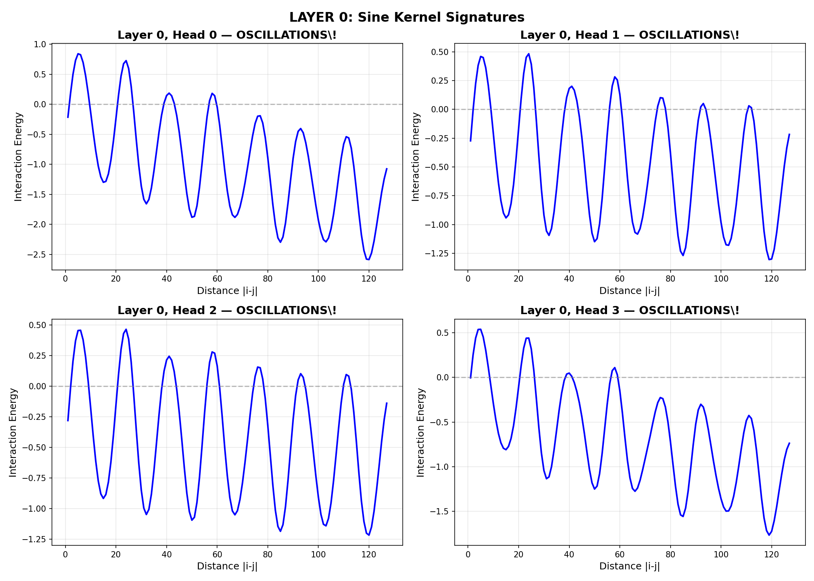

# nanoGPT-RH: Neural Telescope for Riemann Zeta Zeros

A transformer trained on 2 million Riemann zeta zeros discovers GUE-like oscillating kernels.

## Key Result

The network learned a **damped cosine kernel** from the data:

```
f(d) = 1.20 × cos(0.357d − 2.05) × exp(−0.0024d) − 0.96

Period = 17.6 positions
R² = 0.705
```

This is a signature of **spectral rigidity** in Random Matrix Theory (GUE statistics).



## Verification

| Test | Result |
|------|--------|
| Shuffled baseline | PPL = 105.8 (at entropy floor) |
| Real data | PPL = 83.3 (21% below floor!) |
| Random vs Trained | Oscillations 500x stronger after training |
| Reverse test | Symmetric (expected for GUE) |

**The oscillations are NOT a positional encoding artifact** — random (untrained) model shows flat noise.

## Quick Start

```bash
# Setup
uv venv && source .venv/bin/activate
uv pip install torch numpy matplotlib rich scipy

# Prepare data (requires zeros2M.txt in zeros/)
python data/prepare_zeros.py --input zeros/zeros2M.txt --output data --binned

# Train
python train.py --max-steps 5000

# Extract kernels
python extract_kernel.py

# Run audits
python audit.py
```

## Architecture

- **Model**: 0.85M parameter transformer (4 layers, 4 heads, 128 dim)
- **Input**: Binned unfolded spacings (256 bins, seq_len=256)
- **Task**: Next-spacing prediction (classification)
- **Metric**: Perplexity (cross-entropy)

## Files

- `data/prepare_zeros.py` — Unfolding and binning pipeline
- `model/gpt.py` — SpacingGPT transformer
- `train.py` — Training loop
- `audit.py` — Leakage/artifact verification
- `extract_kernel.py` — Attention kernel extraction

## Data Source

2,001,052 nontrivial zeros of ζ(s) from [LMFDB](https://www.lmfdb.org/zeros/zeta/).

## References

- Montgomery (1973): Pair correlation of zeta zeros
- Odlyzko (1987): Numerical verification of GUE statistics
- Karpathy: nanoGPT

## License

MIT
